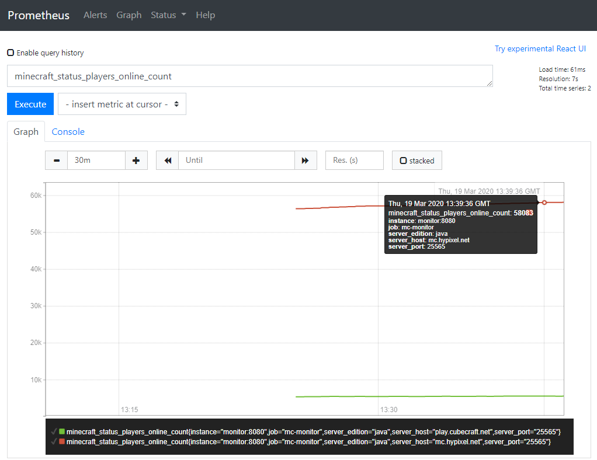

[](https://hub.docker.com/r/itzg/mc-monitor)
[](https://github.com/itzg/mc-monitor/releases/latest)
[](https://github.com/itzg/mc-monitor/actions/workflows/test.yml)

Command/agent to monitor the status of Minecraft servers

## Install module

```
go get github.com/itzg/go-mc-status
```

## Usage

```
Subcommands:
	flags            describe all known top-level flags
	help             describe subcommands and their syntax
	version          Show version and exit

Subcommands for monitoring:
	export-for-prometheus  Registers an HTTP metrics endpoints for Prometheus export
	gather-for-telegraf  Periodically gathers to status of one or more Minecraft servers and sends metrics to telegraf over TCP using Influx line protocol

Subcommands for status:
	status           Retrieves and displays the status of the given Minecraft server
	status-bedrock   Retrieves and displays the status of the given Minecraft Bedrock Dedicated server
```

## Examples

### Checking the status of a server

To check the status of a Java edition server:

```
docker run -it --rm itzg/mc-monitor status --host mc.hypixel.net
```

To check the status of a Bedrock Dedicated server:

```
docker run -it --rm itzg/mc-monitor status-bedrock --host play.fallentech.io
```

where exit code will be 0 for success or 1 for failure.

### Monitoring a server with Telegraf

> The following example is provided in [examples/mc-monitor-telegraf](examples/mc-monitor-telegraf)

Given the telegraf config file:

```toml
[[inputs.socket_listener]]
  service_address = "tcp://:8094"

[[outputs.file]]
  files = ["stdout"]
```

...and a Docker composition of telegraf and mc-monitor services:

```yaml
version: '3'

services:
  telegraf:
    image: telegraf:1.13
    volumes:
    - ./telegraf.conf:/etc/telegraf/telegraf.conf:ro
  monitor:
    image: itzg/mc-monitor
    command: gather-for-telegraf
    environment:
      GATHER_INTERVAL: 10s
      GATHER_TELEGRAF_ADDRESS: telegraf:8094
      GATHER_SERVERS: mc.hypixel.net
```

The output of the telegraf service will show metric entries such as:

```
minecraft_status,host=mc.hypixel.net,port=25565,status=success response_time=0.172809649,online=51201i,max=90000i 1576971568953660767
minecraft_status,host=mc.hypixel.net,port=25565,status=success response_time=0.239236074,online=51198i,max=90000i 1576971579020125479
minecraft_status,host=mc.hypixel.net,port=25565,status=success response_time=0.225942383,online=51198i,max=90000i 1576971589006821324
```

### Monitoring a server with Prometheus

When using the `export-for-prometheus` subcommand, mc-monitor will serve a Prometheus exporter on port 8080, by default, that collects Minecraft server metrics during each scrape of `/metrics`.

The sub-command accepts the following arguments, which can also be viewed using `--help`:
```
  -bedrock-servers host:port
    	one or more host:port addresses of Bedrock servers to monitor, when port is omitted 19132 is used (env EXPORT_BEDROCK_SERVERS)
  -port int
    	HTTP port where Prometheus metrics are exported (env EXPORT_PORT) (default 8080)
  -servers host:port
    	one or more host:port addresses of Java servers to monitor, when port is omitted 25565 is used (env EXPORT_SERVERS)
```

The following metrics are exported
- `minecraft_status_healthy`
- `minecraft_status_response_time_seconds`
- `minecraft_status_players_online_count`
- `minecraft_status_players_max_count`

with the labels
- `server_host`
- `server_port`
- `server_edition` : `java` or `bedrock`
- `server_version`

An example Docker composition is provided in [examples/mc-monitor-prom](examples/mc-monitor-prom), which was used to grab the following screenshot:



