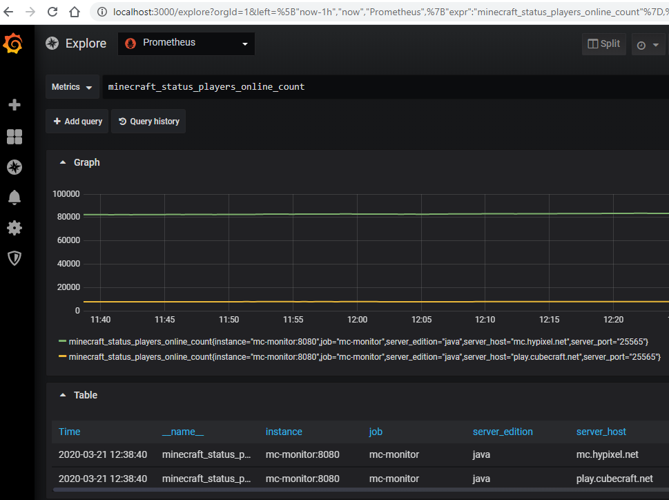

This example uses [kustomize](https://kustomize.io/), which is built into `kubectl` and the example can be deployed using

    kubectl apply -k .
    
It deploys
- mc-monitor : configured to monitor a couple of public Minecraft servers
- prometheus : includes a static config to scrape from mc-monitor
- grafana : pre-configured with prometheus as a datasource

_NOTE: prometheus and grafana are single-replica stateful sets with a 1Gi volume each._

It also deploys a service type of `LoadBalancer` for grafana at port 3000. You will need to use `kubectl get service` to see what IP address was allocated by your provider's load balancer. Follow [the getting started instructions](https://grafana.com/docs/grafana/v6.6/guides/getting_started/#log-in-for-the-first-time) for the initial login information.

The following shows a screenshot of exploring the minecraft status metrics:

